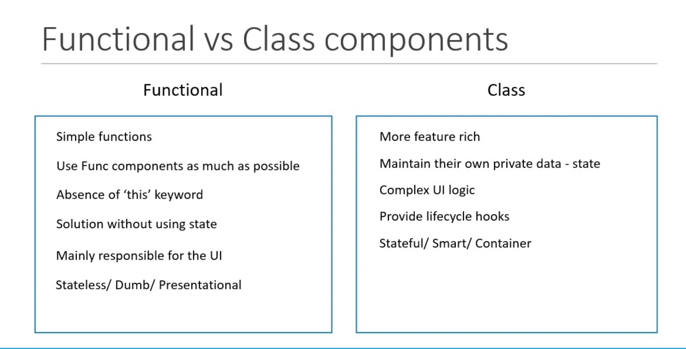

# React Intro
React main page is index.html in Public folder. In src/index.js shows rendered elements in index.html via ReactDom(root div).
index.js renders all the component and push into index.html via DOM(root).
APP.js is the ony component which index.js is fetching.

# React Components
Components are the part of user interface like header, footer, main-body, etc. They are reusable and can be nested inside other components. Every react component return JSX which defines UI. There are two types of components. Which are below
    1. Functional Component (Stateless) : With the introduction of Hooks, Functional Components are not stateless now.
    2. Class Component (Stateful)

## Stateless Functional Component
These are javascript normal functions which return html.

### Component Export
    In order to use our components we have to first export them and then import them where we want to use. Because without export React
    will not aware of this component. Anythng we do in react we have to tell them.
    There are two types:
    1. Defualt Export: it's a defualt export and we can give our own name when importing like import MyComponent from './components/Greet'
    2. Named Export: in this way we have to use exact same name which is exported and write export with func which is returning.
        like export const greet = () => return <h1>Hello Hussnain</h1> 

## Statefull Class Component
These are ES6 classes which extends React Components and return rendered html. they can also accept properties optionaly.
They also maintain it's private State means it can mantain some information which is private to that Component and use that information to describe user interface.

## Functional Component vs Class Component

<b>Functional Components<b>
    1. Simple Functions
    2. Use Func Components as much as possible.
    3. Absence of 'this' keyword
    4. Solution without using state -- not valid now, as hooks comes.
    5. Mainly responsible for the UI
    6. Names: Stateless/dumb/Presentational : With the introduction of Hooks, Functional Components are not stateless now.

<b> Class Component <b>
    1. More feature rich
    2. Maintain there own private data - State
    3. Complex UI Logic
    4. Provide lifecycle Hooks
    5. Names: Statefull/ Smart/ Container.

 Functional components are better because they are easy to maintain and easy to debug during issues. So prefer to use functiona over class components.

# React JSX
JSX is javascript XML. It introduced so that we can write HTML like html in javascript which makes easier to read and write.
see picture 2.1-JSX for code example.

# Props - Properties
Properties which are sent from where components used to components. There are different ways in both class and function components.
In Function Components it is accepted as an object(props) in function parameter. But in Class Component it can be accessed via this keyword. like "this.props.---".

# Component State
States are like variables and we declare in class component contstructor and then they can be changed dynamically via this.setState.
The main difference between props and state is that props are immutable(cannot be changed in components when passed from where it used).
    Props are immutable parameters that are passed to the component from outside.
    State is mutable variables that are managed within the component and can change over time.
    Props are accessed as props in functional components and as this.props in class components.
    State is accessed as useState hook in functional components and as this.state in class components.

A state is an object which is privately maintained inside the object.

## setState
    setState: A method to update the state of a React component and trigger a re-render.
    Never modify the state directly: Doing so will not re-render the component and may cause errors.
    Use a callback function: To execute code after the state has been updated, pass a function as the second argument to setState.
    Use a function as an argument: To update the state based on its previous value, pass a function that returns an object as the first argument to setState.

# Destructing Props and States
we can also destruct props and states.
    const {name, lastName} = props;
    const {state1, state2} = state;

# Event Handler
In react we call event against certain event like below
    onClick={eventHandler}
and in Class Component we call like below, and define function without function keyword
    onClick={this.eventHandler} 

## Binding Event Handler
It is a issue in Class Component and we have 4 ways. 3 and 4 are best, 3rd preffered but 4 also good but in testing phase.
  1.  <button onClick={this.ClickedHandler.bind(this)}>EventBind</button>  Bind with this here          Performance issue 
  2.  <button onClick={()=> this.ClickedHandler()} > EventBind </button> use arrow function- minor improved and easy to pass parameters and good if your component not using re-rendring nested component and best for small apps
  3.  <button onClick={this.ClickedHandler}>EventBind</button>             Bind in constructor                 best One 
  4.  <button onClick={this.ClickedHandler}>EventBind</button> using clickedhandler as arrow func Best Also but in testing phase.
            

# Methods as Props
It is for parent child communication. we pass methods to children for that via props. let's create ParentComponent and ChildComponent for this demonstration. 

# Conditional Rendering
If we want to render or not render some HTML on certain conditions then we have 4 ways to do.
1. If Else condition
2. Element Variable
3. Ternary Operator   -- Recomended
4. Short Circuit Operator (&&) - if you want to show some HTML or none   -- Recomended
See UserGreeting.js file for example.

# List Rendering
Sometimes we need to render list of items like, Names, Products, SERVICES, courses. for that we have to use some HTML again and again. To avoid this repetition by ourself we assign this task to map.
part-2: But typicaly we have list of objects that we need to render some info from that. 
it is always a good idea to render that info in seperate component and show in this component within map method.
let's see example, for that we are creating new Component called Persons.js
See NameListRendering.js for demonstration.

# List and Keys
Add pic here.
“key” is a special string attribute needed when creating lists of elements to give them a stable identity, help React identify which items have changed, are added, or are removed, and assist in the efficient update of the user interface.

Lists and Keys: A title of a ReactJS tutorial that covers how to create and render lists of elements in React.
How to Use Key: Key should be given to the elements inside the map() function, not to the array itself. Key should be unique among the siblings, but not globally. Key can be derived from the data, such as an ID or an index.

# Index as Key Anti-pattern
if no unique thing present in a list then we can use index of array as key, which is passed as 2nd arguments to the arrow func. But there is a issue with index as key. it will not work accuratly when you have to sort the list or create new items at start. So when to use index?
You can use Index as key if these 3 conditions satisfied.
1. The items in your list do not have a unique id.
2. The list is a static list and will not change.
3. The list will never be reordered or filtered.
if any of these condition do not meet then you can use npm package to generate unique ids for you.

# Styling React Components
We have 4 ways to style react a react component. We will cover first three now and will cover 4th later in detail.
1. CSS StyleSheets: 
    Refer to file StyleSheet.js for demonstration of this.

2. Inline Styling: 
    In react inline style not work as core HTML, we have to create object of css elements and then add style attribute with this object. Refer to file StyleSheet.js for demonstration of this.
    
3. CSS Modules: 
    CSS module class are locally scoped and you cannot access them in child components, while other will be accessed and caused conflicts.
    Refer to App.js file
        import './appStyle.css'
        import style from './appStyle.module.css'

        <h1 className={`error`}>Error</h1>
        <h1 className={style.success}>Success</h1>

4. CSS in JS Libaries:     Recomended -> (Styled Components) 
    A seperate series will come for this.

